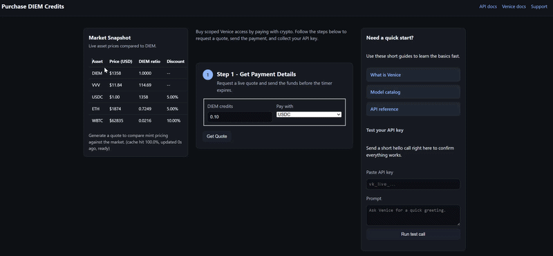

# Venice Capacity Broker

Self-hosted reseller for unused [Venice AI](https://venice.ai) DIEM. Stake VVV, sell scoped inference keys, and collect USDC, ETH, or WBTC on Base.

Live buyer page: [capacity-broker.replit.app/buy.html](https://capacity-broker.replit.app/buy.html)

## Frontend preview



## What it does

This is a **capacity broker** you run yourself, not a multi-seller marketplace. Point it at your Venice parent key and a Base treasury, then sell unused daily DIEM as scoped API keys.

Staking VVV earns a daily DIEM allocation (Venice inference credit). Idle credit does not pay you unless you resell it. The broker prices that credit from the live DIEM market, accepts payment on Base, verifies the transfer, and mints a Venice sub-key with `consumptionLimit` (DIEM units) and `expiresAt`. Buyers get API access, not DIEM tokens. Crypto lands in your treasury.

A single-loop orchestrator can keep the inventory behind the storefront funded: StakeMaster (stake and restake VVV), a quorum-gated ArbiDiem trader (mint/sell or buy/burn DIEM vs market), CapacityBroker utilization policy, and AI Treasurer guidance.

## Pricing and discounts

One quote unit is one DIEM. The market engine uses the live DIEM USD price, then applies a utilization markup (`PRICE_UTIL_ALPHA`) so tight inventory costs more.

A per-asset discount then cuts that marked-up price. Defaults in code are 5% for USDC and ETH, 10% for WBTC. Override with `PRICE_DISCOUNT_DEFAULT_BPS` or `PRICE_DISCOUNT_USDC_BPS` / `PRICE_DISCOUNT_ETH_BPS` / `PRICE_DISCOUNT_WBTC_BPS` (100 = 1%). Set an asset to `0` to sell it undiscounted.

Accepted payment assets are `ACCEPT_ASSETS` (default `ETH,USDC,WBTC`). The buy page Market Snapshot shows each asset's USD price, DIEM ratio, and discount.

When utilization is high, CapacityBroker can suggest surge pricing or pausing low-tier intake. When it is low, it can suggest a discount capped by `BROKER_DISCOUNT_MAX_BPS`.

## Layout

- `apps/broker_api` — public HTTP API and purchase flow
- `apps/control-plane` — static buy page and admin UI
- `apps/cli` — operator CLI (`vvv-agents`)
- `agents/` — StakeMaster, ArbiDiem, CapacityBroker, quorum, reflex
- `services/` — staking, DIEM, market data, keys, risk
- `graph/` — orchestrator loop
- `docs/` — configuration, deployment, operations

## Quick start

Python 3.10+ and [uv](https://docs.astral.sh/uv/) are required.

```bash
uv sync --extra dev --extra broker
cp .env.example .env
```

Set at least `VENICE_API_KEY` (or `VENICE_PARENT_KEY`), `TREASURY_ADDRESS`, `BASE_RPC_URL`, and `SQL_DATABASE_URL` in `.env` or your host secrets. Never commit `.env` or `.env.local`.

```bash
uv run uvicorn apps.broker_api.app:app --reload --port 8000
uv run pytest tests/test_purchase_security.py tests/test_buyer_e2e.py -q
```

`VENICE_API_BASE_URL` must include `/api/v1` (example: `https://api.venice.ai/api/v1`).

## Deploy

Docker: `docker compose up` (see [docs/DEPLOYMENT.md](docs/DEPLOYMENT.md) and [docs/DOCKER_DEPLOYMENT.md](docs/DOCKER_DEPLOYMENT.md)).

Replit: [docs/REPLIT_DEPLOYMENT.md](docs/REPLIT_DEPLOYMENT.md). Store keys in Replit Secrets, not files.

## Buy flow

1. `GET /v1/quotes` returns a priced quote in the chosen asset (persisted synchronously).
2. The buyer pays the treasury on Base.
3. `GET /v1/purchases/challenge` plus a wallet signature prove ownership.
4. `POST /v1/purchases/verify` checks chain id, confirmations, token, and amount, then mints a scoped key.

Unauthenticated status endpoints never return the API key.

## License

MIT. See [LICENSE](LICENSE).
