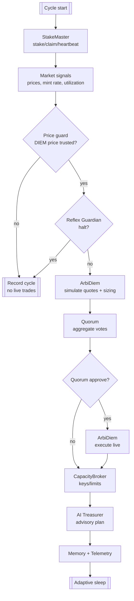
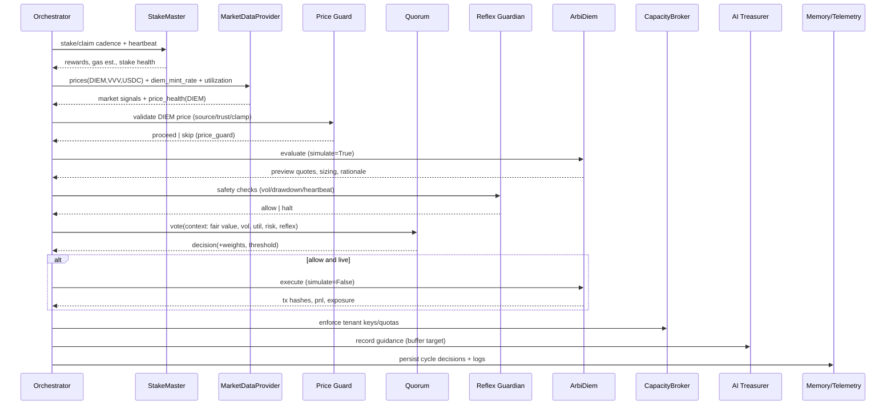
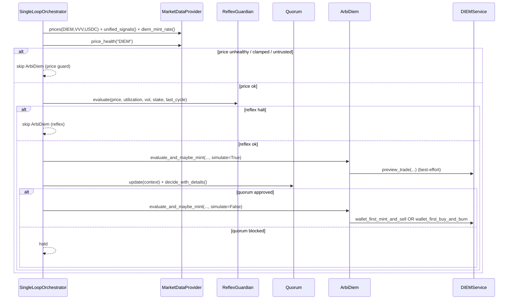

# Venice Capacity Broker - Architecture Overview

**Last Updated:** August 16, 2026

## Table of Contents

1. [System Overview](#system-overview)
2. [Repository Structure](#repository-structure)
3. [Broker API Architecture](#broker-api-architecture)
4. [Agent Orchestration](#agent-orchestration)
5. [Key Services](#key-services)
6. [Deployment](#deployment)
7. [References](#references)

## System Overview

The Venice Capacity Broker is a production-ready autonomous system that:

- **Stakes VVV tokens** to earn daily DIEM allocation and emissions
- **Arbitrages DIEM** against market prices using risk-gated workflows
- **Issues scoped API keys** to resell compute capacity
- **Manages multi-tenant** quota, rate limits, and billing
- **Sells unused Diem** on a public buy page: spot quotes now, or limit bids that settle into the same quote and verify path

The system runs as a single-loop orchestrator with quorum voting, reflex guardrails, and AI Treasurer guidance.

## Repository Structure

```
venice/
├── apps/                    # Application entrypoints
│   ├── broker_api/          # Modular FastAPI application
│   │   ├── app.py           # App factory with dependency injection
│   │   ├── auth.py          # Authentication & authorization
│   │   ├── config.py        # Configuration helpers
│   │   ├── cache.py         # Response caching
│   │   ├── store.py         # Tenant store factory
│   │   ├── lifespan.py      # Lifecycle management
│   │   ├── rate_limit.py    # Rate limiting setup
│   │   ├── marketdata.py    # Market data provider
│   │   ├── routers/         # API route handlers
│   │   │   ├── admin.py
│   │   │   ├── tenants.py
│   │   │   ├── quotes.py
│   │   │   ├── purchases.py
│   │   │   ├── bids.py
│   │   │   ├── clearing.py
│   │   │   ├── settlement.py
│   │   │   └── venice.py
│   │   └── services/        # Business logic helpers
│   │       ├── pricing.py
│   │       ├── clearing.py
│   │       └── bids.py
│   ├── cli/                 # Operator CLI
│   │   └── main.py
│   └── control-plane/       # Admin UI (static)
│
├── agents/                  # Autonomous agents
│   ├── stake_master/        # VVV staking agent
│   ├── arbi_diem/           # DIEM arbitrage agent
│   ├── capacity_broker/     # Key issuance agent
│   ├── ai_treasurer/        # Treasury management agent
│   ├── quorum/              # Voting coordination
│   └── reflex/              # Risk guardrails
│
├── services/                # Core services
│   ├── staking/             # VVV staking client
│   ├── diem/                # DIEM mint/burn
│   ├── marketdata/          # Price aggregation
│   ├── venice_keys/         # Key management
│   ├── memory/              # Decision persistence
│   ├── risk/                # Risk policy
│   ├── wallet/              # Wallet providers
│   └── pricing/             # Pricing service
│
├── graph/                   # Orchestration
│   ├── workflows/           # Single-loop orchestrator
│   ├── nodes/               # Graph node functions
│   └── langgraph/           # LangGraph integration
│
├── libs/                    # Shared libraries
│   ├── telemetry/           # Logging & metrics
│   ├── dex/                 # DEX aggregation
│   ├── kv/                  # Key-value stores
│   ├── ratelimit/           # Rate limiting
│   └── venice_sdk/          # Venice API client
│
├── db/                      # Database layer
│   ├── models.py            # SQLModel schemas
│   ├── session.py           # Session management
│   └── migrations/          # Alembic migrations
│
├── tests/                   # Test suite
├── docs/                    # Documentation
├── infra/                   # Infrastructure configs
│   ├── docker/
│   ├── replit/
│   ├── k8s/
│   └── terraform/
└── config/                  # Configuration files
```

## Broker API Architecture

The Broker API follows a **modular router architecture** with clean separation of concerns:

### Core Components

**App Factory** (`app.py`)
- Creates FastAPI instance with lifespan management
- Builds dependency injection container
- Wires modular routers
- Configures CORS and static routes

**Authentication** (`auth.py`)
- Bearer token extraction
- Admin authentication
- Tenant authorization via subkey
- Startup validation

**Configuration** (`config.py`)
- Environment-driven defaults
- Expiry timestamp computation
- Recursive field extraction

**Caching** (`cache.py`)
- Price response caching with TTL
- Env-and-prices combined cache
- Configurable capacity limits

**Rate Limiting** (`rate_limit.py`)
- KV-backed sliding window limiter
- Per-tenant override support
- SQL compaction for analytics

**Market Data** (`marketdata.py`)
- Thread-safe singleton provider
- DEX quote aggregation
- Etherscan discovery

**Lifecycle** (`lifespan.py`)
- Async context manager
- Market data warming on startup
- Cache preloading

### Service Helpers

**Pricing** (`services/pricing.py`)
- Quote generation
- Settlement pricing

**Clearing** (`services/clearing.py`)
- DIEM clearing price computation
- Configurable basis point bands

**Bids** (`services/bids.py`)
- EIP-712 signature verification
- Asset price conversion
- Bid status classification

### Router Organization

Each router handles a specific domain:

- **admin** - System monitoring, quotes/purchases listings
- **tenants** - Tenant CRUD, rotation, limits
- **quotes** - Spot quote generation; persist for verify
- **purchases** - Payment verification and key issuance (also fills a linked bid)
- **bids** - EIP-712 limit bids (`BIDS_ENABLED`)
- **clearing** - Clearing price classification and optional SSE (`CLEARING_ENABLED`)
- **settlement** - Persist a quote onto a bid; DEX preview helpers. Confirm is an alias of purchase verify.
- **venice** - Venice API proxy endpoints

## Agent Orchestration

### Design principles

- Single-loop orchestrator for simplicity and determinism.  Quorum gates any live action, and Reflex provides a hard safety stop.

- Advisory-only Treasurer records guidance so operators can review before trades.  Run modes move from dry → progressive-live → live with explicit toggles.

- Every cycle persists decisions, rationale, and outcomes to memory and telemetry for post-trade review.  CLI entrypoints are idempotent and safe by default.

### Control flow at a glance



The orchestrator lives in `graph/workflows/orchestrator.py` and executes the nodes in a fixed sequence each cycle.  ArbiDiem always simulates first so Quorum votes on context before any live trades.  Price health and Reflex gates run before any Quorum approval can result in execution.

### Detailed sequence



### State and data contracts

- Market data provider (`services/marketdata/provider.py`) aggregates DEX quotes and Venice signals with price sanity clamps.  The path engine (`services/marketdata/pathing/`) discovers DIEM-specific routes and tags external fallbacks with `fallback_reason=no_onchain_liquidity`.  Tune with `MARKETDATA_PRICE_SANITY_MAX_DRIFT` and related envs.

- Risk policy (`services/risk/policy.py`) sizes orders using utilization, volatility caps, and pool‑take limits.  Govern with `RISK_MAX_SLIPPAGE_BPS`, `RISK_MAX_POOL_TAKE_BPS`, and `RISK_MAX_VOLATILITY_BPS`.  When `SQL_DATABASE_URL` is set, the orchestrator writes `PriceTick` rows (`services/risk/pricetick.py`) and seeds the last 16 prices into vol history unless `RISK_VOL_PERSIST=0`.

- Broker inventory (`services/broker/inventory.py`) is the quote markup source: tenant Diem used / issued limits from `BROKER_INVENTORY_POLICY_PATH`.  Markup is `1 + utilization * PRICE_UTIL_ALPHA`.  Failsafe `hot` pauses new quotes and bids.

- DIEM pricing (`libs/pricing/diem.py`) computes multi-factor fair value using finite-horizon PV with adoption-based scaling, supply scarcity, demand pressure, and sentiment adjustments. Applies illiquidity discount when no on-chain DEX pools exist. Returns component breakdowns and confidence scores for transparent decision logging.

- Venice keys manager (`services/venice_keys/manager.py`) issues scoped sub‑keys; every sub‑key must include `consumptionLimit` and `expiresAt`.  Abuse triggers immediate revocation.

- Memory store (`services/memory/store.py`) writes `db/agent_memory.jsonl` or SQL when configured.  Reflection (`services/memory/reflection.py`) critiques outcomes post‑action.

- Wallet and chain config (`services/wallet/*`) provide Base RPC, chain id, and gas strategy used by StakeMaster and ArbiDiem.

- Quorum (`agents/quorum/*`) collects model votes: Yield, Arb, Risk (weight 2.0), Demand, Treasury.  Configure with `QUORUM_ENABLE`, `QUORUM_THRESHOLD`, and `QUORUM_WEIGHT_*`.

### ArbiDiem arbitrage + mint/burn (source of truth)

This section is the canonical architecture for the ArbiDiem decision and execution flow.

It documents how fair value is computed, how premium/discount thresholds map to actions, and how Quorum and guardrails gate live execution.

#### Inputs (signals and state)

ArbiDiem consumes the following inputs per cycle:

- **Market price (DIEM/USD)**: `MarketDataProvider.prices(["DIEM"])` with `MarketDataProvider.price_health("DIEM")` metadata for trust and clamp state.

- **VVV price (VVV/USD)**: `MarketDataProvider.prices(["VVV"])`.

- **Mint rate**: `MarketDataProvider.diem_mint_rate()["tokens_per_diem"]`, interpreted as sVVV token units required per 1 DIEM token.

- **Utilization**: `MarketDataProvider.unified_signals()["vvv"]["utilization"]` when available.

- **Circulating DIEM supply**: `DIEMService.get_circulating_supply()` when available.

- **Wallet inventory snapshot**: captured once per decision (`InventorySnapshot`) and reused to avoid mid-cycle re-queries.

If DIEM price is clamped, stale, or untrusted, the orchestrator records `price_guard` and skips ArbiDiem execution for that cycle.

#### Fair value (pricing model)

Fair value is computed by `libs/pricing/diem.py:fair_value_per_diem(...)` and returns `fair_value`, a component breakdown, and a confidence score.

The model blends:

- **Mint cost floor**: `mint_cost = vvv_price * mint_rate`, plus an emissions opportunity-cost adjustment.

- **Utility PV**: a finite-horizon PV of `$1/day` compute, scaled by an adoption proxy derived from utilization (or a baseline).

- **Supply and market modifiers**: scarcity (supply vs target), demand (adoption), and sentiment (price ratio vs history).

- **Illiquidity discount**: applied when the DIEM price source indicates no on-chain liquidity.

The finite horizon is intentionally a configurable policy knob:

- `DIEM_FAIR_VALUE_HORIZON_DAYS` controls the PV horizon (default 365 days).

#### Decisioning (premium / discount)

ArbiDiem compares market price to fair value and selects one of three actions:

- **mint_sell**: market trades rich vs fair value.

- **buy_burn**: market trades cheap vs fair value.

- **hold**: neither condition is met or execution prerequisites are not satisfied.

Premium and discount thresholds are policy defaults unless explicitly overridden:

- `DIEM_PREMIUM_THRESHOLD` and `DIEM_DISCOUNT_THRESHOLD` are read by `services/risk/policy.py:RiskPolicy.from_env()`.

#### Execution (live) and invariants

The orchestrator enforces the following gating order before any live action:

1. Price guard (DIEM price trust and clamp rules).

2. Reflex Guardian veto (drawdown, volatility, stake health, provider error streak).

3. Simulated ArbiDiem evaluation (`simulate=True`) to produce rationale and previews.

4. Quorum vote over the cycle context and rationale.

5. Live replay of ArbiDiem evaluation (`simulate=False`) when Quorum approves.

**Mint/sell path (wallet-first)**

- Uses `DIEMService.wallet_first_mint_and_sell()`:

  - Sells existing wallet DIEM first (skipping dust via `DIEM_MIN_SELL_UNITS`).

  - Mints and sells only the remaining shortfall.

**Buy/burn path (wallet-first)**

- Uses `DIEMService.wallet_first_buy_and_burn()` in live mode.

- Burnability is constrained by locked sVVV backing.

  If the wallet has no locked sVVV, burns are blocked and the system recommends selling DIEM instead.

**Key invariant**

The burn rule is: a burn is only eligible up to the wallet’s locked sVVV capacity.

That is the on-chain constraint the system enforces.

#### Observability (what gets logged and persisted)

Each cycle records an `arbi` block containing:

- `price`, `mintRate`, `signals` (utilization, vol), and `limits` (risk caps).

- `why` rationale including `fair_value`, `fair_value_components`, thresholds, and `decision`/`reason`.

- `execution` summary plus `correlationId`.

This record is persisted by the memory store and is used by reflection to apply post-action critique and optionally latch halts.

### Run modes

- Dry‑run by default.  Progressive‑live flips to live after healthy StakeMaster heartbeats.  Enable‑live runs live from cycle one when explicitly set.

```bash
uv run python apps/cli/main.py run:loop --dry-run
uv run python apps/cli/main.py run:loop --progressive-live
uv run python apps/cli/main.py run:loop --enable-live
```

### Safety and guardrails

- Reflex Guardian (`agents/reflex/guardian.py`) halts live execution on volatility > 450 bps or drawdowns > 0.12, or when staking heartbeats lapse.  Tune with `REFLEX_MAX_VOL_BPS`, `REFLEX_MAX_PRICE_DRAWDOWN`, and heartbeat knobs.

- Price sanity clamps reject stale/drifting quotes and keep the internal price during spikes unless widened explicitly.  Prefer tightening only during incident response.

- `AGENTS_PAUSED=true` provides an immediate stop without bringing the Broker API down.

### Extensibility

- Add a node by implementing a focused agent module under `agents/*` and a callable node under `graph/nodes/*`.  Wire it into the orchestrator sequence.

- Feed decision‑critical nodes into Quorum, emit rationale for telemetry, and persist outcomes to the memory store.  Add tests alongside `tests/test_single_loop_orchestrator.py`.

- Keep surfaces stable and configuration‑driven.  Prefer small, composable nodes over complex branching inside a node.

## Key Services

### Staking Service

- VVV staking contract interaction
- Reward claiming and compounding
- Cooldown scheduling

### DIEM Service

- Mint/burn operations with sVVV locking
- Capacity gate enforcement
- On-chain mint rate fetching with fallback to Venice metrics
- Circulating supply tracking for fair value calculations
- Finite-horizon PV model with adoption baseline (60%) and illiquidity discount (20%)
- CLI exposure via `diem:mint-rate [--live]`

### Market Data Provider

- Multi-DEX quote aggregation (Uniswap V2, Aerodrome, Uniswap V3)
- Venice signal integration (utilization, circulating supply, staking yield)
- Price sanity clamping with DIEM-specific trust rules
- Reserve cap computation for pool-take limits
- Path quote engine with DIEM-optimized route discovery
- External reference fallback with metadata tagging (`fallback_reason`)

### Venice Keys Manager

- Parent/sub-key management
- Consumption limit enforcement
- Automatic revocation on abuse

### Memory Store

- Decision logging to JSONL
- Reflection engine critiques
- Long-term recall for agents

### Risk Policy

- Utilization-based sizing
- Volatility caps, seeded from persisted `PriceTick` history when SQL is on
- Slippage and pool-take limits
- Liquidity-aware adjustments

### Broker inventory

- CapacityBroker writes utilization and failsafe into `BROKER_INVENTORY_POLICY_PATH`
- Quotes and bids read that snapshot; they do not use request Counters or `CAPACITY_UNITS_PER_MIN`
- DIEM live execution is aggregator composite only (`trade_best` / `trade_best_exact_out`). There is no two-tx or bridge-exec flag.

## ArbiDiem: Arbitrage, Minting, and Fair Value (Source of Truth)

This section is the canonical description of the **ArbiDiem** arbitrage decision and execution flow.  

It is intended as a stable reference for operators and developers.  

### Goals and invariants

ArbiDiem exists to exploit deviations between **DIEM market price** and an internally computed **fair value**, while respecting risk and execution constraints.  

Key invariants:

- **Live trading is always gated**: price-health guard → ReflexGuardian → Quorum vote → execution replay.  

- **Burn eligibility is collateral-bound**: DIEM can only be burned up to the wallet’s **locked sVVV backing**.  

  DIEM acquired on a DEX is only burnable if the wallet still has locked sVVV capacity available.  

  If locked sVVV is zero, burning is blocked and the system should prefer a DEX sell path.  

### Primary modules

- **Decision logic**: `agents/arbi_diem/agent.py` (`ArbiDiem.evaluate_and_maybe_mint`).  

- **Fair value model**: `libs/pricing/diem.py` (`fair_value_per_diem`).  

- **Mint/burn + DEX execution**: `services/diem/client.py` (`mint`, `burn`, `preview_trade`, `execute_trade`, wallet-first helpers).  

- **Orchestration + gating**: `graph/workflows/orchestrator.py` (`SingleLoopOrchestrator.run_cycle`).  

- **Risk sizing**: `services/risk/policy.py` (`RiskPolicy`).  

- **Market signals and price health**: `services/marketdata/provider.py` (`prices`, `price_health`, `diem_mint_rate`).  

### End-to-end cycle flow (live gating)

The orchestrator runs ArbiDiem twice in live mode: first as a **simulation** to produce a rationale, then as a **replay** if gating approves.  
We


### Fair value model (what ArbiDiem compares against)

Fair value is computed by `libs/pricing/diem.py:fair_value_per_diem()`.  

It returns `fair_value` plus `components` and a `confidence` score for logging and review.  

ArbiDiem supplies inputs derived from live signals:

- `vvv_price` from `MarketDataProvider.prices(["VVV"])`.  

- `mint_rate` as `tokens_per_diem` from `MarketDataProvider.diem_mint_rate()`.  

- utilization (current and short-term trend).  

- circulating supply (best-effort via `DIEMService.get_circulating_supply`).  

- a bounded sentiment signal from recent DIEM/VVV price ratios.  

- `has_onchain_liquidity` inferred from DIEM price sourcing (on-chain vs fallback).  

The fair value calculation blends:

- **Mint-cost floor**: \( base\_cost = mint\_cost + emissions\_cost \).  

  \( mint\_cost = vvv\_price \times mint\_rate \).  

  \( emissions\_cost = mint\_cost \times emissions\_penalty \times EMISSIONS\_APY \).  

- **Utility PV**: finite-horizon PV of **$1/day** compute scaled by an adoption proxy.  

  Horizon is configurable via `DIEM_FAIR_VALUE_HORIZON_DAYS` (default 365).  

- **Multipliers**: scarcity (target supply ~38k), demand (adoption), sentiment, and an illiquidity discount when on-chain liquidity is absent.  

Final invariant: **fair value never falls below mint cost** (`max(fair_value, base_cost)`).  

### Decision thresholds (premium/discount triggers)

ArbiDiem uses **RiskPolicy thresholds** as the default behavior.  

This means:

- `DIEM_PREMIUM_THRESHOLD` (if set) overrides the premium trigger.  

  Otherwise it defaults to the risk policy’s configured default (1.05).  

- `DIEM_DISCOUNT_THRESHOLD` (if set) overrides the discount trigger.  

  Otherwise it defaults to the premium trigger value unless configured differently.  

ArbiDiem records `threshold_mult` and `discount_mult` into the per-cycle `why` rationale for auditability.  

### Execution flows

#### Premium branch: mint and sell (mint_sell)

If `market_price > fair_value * threshold_mult`, ArbiDiem attempts to realize premium by selling DIEM.  

Execution uses a **wallet-first** approach via `DIEMService.wallet_first_mint_and_sell()`:

1) Sell existing wallet DIEM above dust threshold (`DIEM_MIN_SELL_UNITS`).  

2) Mint only the remaining shortfall, then sell it via `mint_and_sell_diem()`.  

Sizing and execution are bounded by:

- risk sizing caps (`RISK_MAX_DIEM_TRADE_USD`, optional portfolio cap).  

- slippage cap (`RISK_MAX_SLIPPAGE_BPS`).  

- reserve/pool-take caps (`RISK_MAX_POOL_TAKE_BPS` via `reserve_cap_units`).  

#### Discount branch: buy and burn (buy_burn)

If `market_price < fair_value / discount_mult`, ArbiDiem attempts to reduce exposure by burning DIEM to unlock sVVV.  

Execution uses `DIEMService.wallet_first_buy_and_burn()`:

1) Burn wallet DIEM first, but only up to verified burn eligibility (locked sVVV backing).  

2) If additional burn is desired, buy DIEM on DEX and burn it, subject to exact-out preview/route support and risk caps.  

Important operational note: a buy/burn attempt will be rejected when locked sVVV is zero or cannot be verified safely.  

In that case, the system should treat the DIEM as spot inventory and prefer selling it on DEX rather than attempting to burn.  

### Observability (what gets logged as source of truth)

Each cycle persists an `arbi` record with:

- **Inputs**: `price`, `mintRate`, `signals` (utilization, vol), and `limits` (risk caps).  

- **Rationale** (`why`): fair value, component breakdown, confidence, thresholds, and decision reason.  

- **Execution**: a summarized status plus a correlation id, plus execution details when present.  

This record is persisted via `services/memory/store.py` and used by reflection to critique outcomes and optionally latch halts.  

## Deployment

Deployment steps, environment layering, and post-deploy checks have moved to `docs/DEPLOYMENT.md`.

For a single source of truth on environment variables, see `docs/CONFIGURATION.md`.

## References

### Documentation

- **Agent Catalog** - `AGENTS.md`
- **Deployment Guide** - `docs/DEPLOYMENT.md`
- **Configuration** - `docs/CONFIGURATION.md`
- **Tokenomics** - `docs/venice-diem-tokenomics.md`

### Key Files

- **Orchestrator** - `graph/workflows/orchestrator.py`
- **CLI** - `apps/cli/main.py`
- **Broker App** - `apps/broker_api/app.py`
- **Market Data** - `services/marketdata/provider.py`
- **Risk Policy** - `services/risk/policy.py`

### External Resources

- [Venice AI](https://venice.ai) - VVV and DIEM platform
- [OpenAI Agents SDK](https://github.com/openai/openai-agents-python) - Agent patterns
- [LangGraph](https://langchain-ai.github.io/langgraph/) - Multi-agent orchestration

---

**Architecture Status:** Production-ready with modular design  
**Last Major Update:** October 29, 2025 - Completed broker API migration to modular architecture

